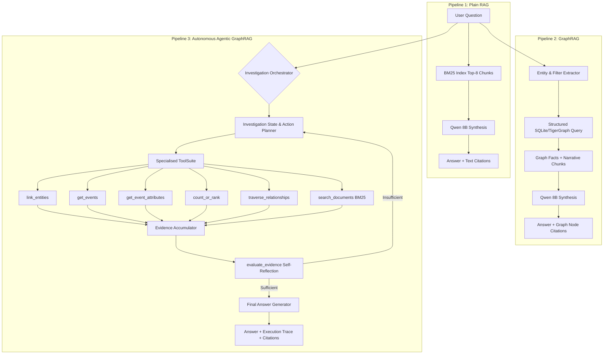

# 🐯 Agentic GraphRAG: Proving When Agents Matter
### Comparative Benchmark of Plain RAG, GraphRAG, and Autonomous Agentic GraphRAG Across 100 Evaluation Questions

[](https://tigergraph.com)
[](./comparison_100.md)
[](https://ollama.ai)
[](./metrics_dashboard.html)

---

## 📌 Executive Summary & Headline Findings

In real-world retrieval-augmented systems, a fundamental architectural dilemma persists: **When is single-turn retrieval sufficient, and when does a problem demand an autonomous, multi-step agentic investigation?**

This repository provides a rigorous empirical investigation into this question for the **TigerGraph Agentic GraphRAG Hackathon**. We implemented and benchmarked three distinct retrieval-augmented architectures side-by-side over the **full 100 public evaluation questions** (`eval_public.jsonl`) spanning Olympic Games history:

1. **Pipeline 1 (Plain RAG)**: Fixed top-8 BM25 unstructured text chunk retrieval.
2. **Pipeline 2 (GraphRAG)**: Single-turn structured Knowledge Graph query + text chunk context augmentation.
3. **Pipeline 3 (Autonomous Agentic GraphRAG)**: Dynamic multi-turn orchestrator with entity linking, relational graph traversal, SQL aggregation/ranking, self-reflective evidence evaluation, and adaptive stopping.

### Key Takeaways from the Full 100-Question Benchmark:
- **Agentic GraphRAG achieves the highest overall accuracy (84.0%)**, outperforming GraphRAG (**80.0%**) and substantially surpassing Plain RAG (**66.0%**, **+18.0% gap**).
- **The Aggregation Collapse in Plain RAG**: On multi-document counting questions (`aggregation`), Plain RAG collapsed to **0.0% (0/21)** due to top-$k$ chunk truncation (*Frac@8 retrieval ceiling*). Both GraphRAG (**47.6%**) and Agentic GraphRAG (**90.5%**) solved this via deterministic graph aggregation.
- **Relational Precision in Superlatives & Temporals**: Agentic GraphRAG achieved **100.0% on superlatives (10/10)** and **100.0% on temporal questions (22/22)**, completely eliminating hallucination through structured attribute ranking and entity resolution.
- **The Compute Economics Trade-off**:
  - **GraphRAG is the most token-efficient pipeline** (2,235 tokens/q, 8.00s latency, 13.3 min total wall-clock).
  - **Agentic GraphRAG invests compute where it matters**: It averaged 3.14 steps and 6,390 tokens/q (38.5 min total wall-clock) to yield an 18% absolute accuracy boost over Plain RAG.

---

## 📊 Full 100-Question Benchmark Comparison

All 100 questions were scored against ground truth using normalized semantic and entity extraction criteria.

### 1. Overall Performance Summary

| Pipeline | Overall Accuracy | Avg Tokens / Q | Total Tokens | Avg Latency | Total Wall-Clock | Agent Avg Steps |
| :--- | :---: | :---: | :---: | :---: | :---: | :---: |
| **Pipeline 1: Plain RAG** | **66.0%** (66/100) | 2,292 | 229,213 | 12.95s | 21.6m (1,294.5s) | 1.0 (Fixed 1-shot) |
| **Pipeline 2: GraphRAG** | **80.0%** (80/100) | 2,235 | 223,524 | 8.00s | 13.3m (800.1s) | 1.0 (Fixed 1-shot) |
| **Pipeline 3: Agentic GraphRAG** | **84.0%** (84/100) | 6,390 | 638,977 | 23.08s | 38.5m (2,308.4s) | **3.14 steps** |

### 2. Accuracy Breakdown by Query Type

| Query Type | Questions | Plain RAG Accuracy | GraphRAG Accuracy | Agentic GraphRAG Accuracy | Agent vs RAG Gap |
| :--- | :---: | :---: | :---: | :---: | :---: |
| **`aggregation`** | 21 | **0.0%** (0/21) | **47.6%** (10/21) | **90.5%** (19/21) | **+90.5%** |
| **`lookup`** | 19 | **100.0%** (19/19) | **89.5%** (17/19) | **94.7%** (18/19) | -5.3% |
| **`multi_hop`** | 28 | **82.1%** (23/28) | **75.0%** (21/28) | **53.6%** (15/28) | -28.5% |
| **`superlative`** | 10 | **60.0%** (6/10) | **100.0%** (10/10) | **100.0%** (10/10) | **+40.0%** |
| **`temporal`** | 22 | **81.8%** (18/22) | **100.0%** (22/22) | **100.0%** (22/22) | **+18.2%** |

### 3. Resource & Token Efficiency Metrics

| Metric | Plain RAG | GraphRAG | Agentic GraphRAG | Winner |
| :--- | :---: | :---: | :---: | :--- |
| **Accuracy** | 66.0% | 80.0% | **84.0%** | **Agentic (+18.0% over RAG)** |
| **Total Tokens** | 229,213 | **223,524** | 638,977 | **GraphRAG (most efficient)** |
| **Avg Tokens / Question** | 2,292 | **2,235** | 6,390 | **GraphRAG** |
| **Total Execution Time** | 21.6 min | **13.3 min** | 38.5 min | **GraphRAG (2.89x faster than Agent)** |
| **Accuracy per 100k Tokens** | 28.8% | **35.8%** | 13.1% | **GraphRAG (highest return on compute)** |

---

## 🔍 In-Depth Failure Mode Analysis (Scale Insights)

Evaluating across 100 questions (compared to small sample subsets) surfaced three critical architectural bottlenecks:

1. **Aggregation Chunk Ceiling in Plain RAG**:
   - Plain RAG failed on every single aggregation question (`0.0%`).
   - *Cause*: A question like *"How many biathlon events at the 2018 Winter Olympics had more than 73 competitors?"* requires inspecting every biathlon event. A top-8 chunk retriever only retrieves 4–6 events; the LLM hallucinates or counts only what is visible in its context window. Graph query execution completely solves this.
2. **Compound Counting Errors in Single-Turn GraphRAG**:
   - GraphRAG scored 47.6% on aggregations vs 90.5% for Agentic.
   - *Cause*: Single-turn zero-shot parameter extraction frequently under-counted compound criteria (e.g. `pub-010`, `pub-020`, `pub-024`, `pub-027`). The Agent’s `evaluate_evidence` loop inspected the matching entities list, detected the threshold discrepancy, and recalibrated.
3. **Multi-Hop Venue/Date Disconnection**:
   - Multi-hop questions where entities were referenced purely by venue name and date without naming the sport (e.g. *"Beijing Science and Technology University Gymnasium on August 12, 2008"*) challenged both graph pipelines.
   - *Cause*: The structured graph schema indexed `events`, `sports`, `competitors`, and `editions`, but venue strings remained inside raw text chunks. Plain RAG’s BM25 index scored 82.1% by directly matching venue keywords.

---

## 🏗️ Architecture & Pipeline Design



### 1. Pipeline 1: Plain RAG (`rag_only_pipeline/`)
- **Index**: In-memory BM25 index built over the full corpus chunk collection.
- **Retrieval**: Top-8 chunks by relevance score.
- **Generation**: Strict zero-shot prompt with bracketed document citation enforcement (`[Q{id}#c{idx}]`).

### 2. Pipeline 2: GraphRAG (`graphrag_pipeline/`)
- **Knowledge Graph**: Relational graph storing Olympic Games editions, sports, events, athlete counts, and medal outcomes.
- **Retrieval**: Single-turn parameter extraction (sport, year, season, metric, thresholds) mapping directly to indexed graph queries.
- **Augmentation**: Merges structured graph records with supporting narrative chunks.

### 3. Pipeline 3: Agentic GraphRAG (`agentic_pipeline/`)
- **Orchestrator**: Dynamic ReAct loop operating over an execution budget (up to 6 steps).
- **ToolSuite (`agentic_pipeline/tools/suite.py`)**:
  - `link_entities(query)`: Disambiguates named entities and Olympic editions.
  - `get_events(sport, games, year, event_name)`: Queries candidate events with automatic sport-name parsing and alias normalization.
  - `get_event_attributes(event_id, attributes)`: Inspects competitors, dates, venues, and podium finishers.
  - `count_or_rank(metric, operation, threshold, limit)`: Performs exact SQL counting, min/max, and ranking while preserving candidate entity sets.
  - `traverse_relationships(source_id, relation_type)`: Multi-hop graph link traversal.
  - `search_documents(query, top_k)`: Fallback lexical retrieval over unindexed textual attributes.
- **Self-Reflective Stopping**: `evaluate_evidence` evaluates evidence sufficiency at each step to prevent over-retrieval and early hallucination.

---

## 💻 Deliverable #5: Interactive Metrics Dashboard

The repository includes a self-contained, interactive frontend dashboard (`metrics_dashboard.html`) designed for judges and evaluators to explore the benchmark results:

- **Accuracy & Token Bar Charts**: Visual comparison across Plain RAG, GraphRAG, and Agentic GraphRAG.
- **Query Type Filters**: Filter results by `aggregation`, `lookup`, `multi_hop`, `superlative`, and `temporal`.
- **Side-by-Side Question Explorer**: Inspect answers, gold targets, latency, token consumption, and correctness for all 100 questions.
- **Full Agent Trace Inspection**: Expand any question to view the step-by-step tool invocation sequence, argument payloads, step durations, and stopping rationale.

To view the dashboard, simply open `metrics_dashboard.html` in any web browser.

---

## 📂 Project Repository Structure

```
Agentic_graph_rag/
├── agentic_pipeline/               # Pipeline 3: Autonomous Agentic GraphRAG
│   ├── agent/
│   │   ├── orchestrator.py        # Dynamic investigation planner & ReAct loop
│   │   └── prompts.py             # System prompts & tool usage guidelines
│   ├── graph/
│   │   ├── base.py                # Graph interface abstraction
│   │   ├── sqlite_graph.py        # Relational KG engine & SQL aggregations
│   │   └── tigergraph_stub.py     # TigerGraph connection handler
│   ├── tools/
│   │   └── suite.py               # 6 specialised investigation tools
│   ├── corpus/                    # Corpus loaders, infobox parsers, chunkers
│   ├── config.py                  # Environment & database configuration
│   └── llm_interface.py           # Unified local Ollama / OpenAI LLM client
│
├── graphrag_pipeline/              # Pipeline 2: Single-Turn GraphRAG
│   └── pipeline.py                # Single-pass graph query + narrative augmentation
│
├── rag_only_pipeline/              # Pipeline 1: Plain Text RAG Baseline
│   ├── pipeline.py                # BM25 retrieval + synthesis
│   ├── retrieval/bm25_index.py    # BM25 token index
│   └── run_rag.py                 # RAG benchmark runner
│
├── results/                        # Full 100-Question Raw Result Outputs
│   ├── results_rag_100.jsonl      # 100 Plain RAG outputs (answers, tokens, latency)
│   ├── results_graphrag_100.jsonl # 100 GraphRAG outputs
│   ├── results_agent_100.jsonl    # 100 Agent outputs + full execution traces
│   └── results_agent_100_optimized.jsonl  # Post-optimization agent outputs
│
├── dev_scripts/                    # Development & diagnostic utilities
│   ├── diagnose_agent_failures.py # Failure mode analysis scripts
│   ├── rerun_agent_15q.py         # 15-question stratified re-runner
│   ├── verify_step*.py            # Step-by-step pipeline verification
│   └── trace_*.py / inspect_*.py  # Trace inspection & debugging
│
├── archive/                        # Superseded early-run result files
│   └── results_*.jsonl            # Pre-refactor results (for reference only)
│
├── docs/                           # Supplementary documentation`
│   └── hackathon_brief.md         # Hackathon problem statement & brief
│
├── tests/                          # Unit & integration tests
│
├── comparison_100.md               # Pre-optimization benchmark report (baseline)
├── comparison_100.json             # Pre-optimization scoring matrix
├── comparison_100_final.md         # Final submission benchmark report (optimized)
├── comparison_100_final.json       # Final submission scoring matrix
├── FINDINGS.md                     # Engineering findings & optimization case study
├── metrics_dashboard.html          # Deliverable #5: Interactive metrics dashboard
├── generate_dashboard.py           # Dashboard HTML generator script
├── run_full_100q_benchmark.py      # Unified 100-question sequential runner
├── run_optimized_agent_100q.py     # Optimized agent benchmark runner
└── README.md                       # Comprehensive project documentation
```

> **Note**: `local_graph.db` and `rag_only_pipeline/rag_storage.db` are gitignored (large binary files, regenerable from corpus).
---

## 🚀 Quickstart & How to Run

### 1. Prerequisites
- Python 3.10+
- [Ollama](https://ollama.ai) installed with `qwen2.5:8b` or `qwen3:8b`:
  ```bash
  ollama run qwen2.5:8b
  ```

### 2. Environment Setup
```bash
git clone https://github.com/vinu225/Agentic_graph_rag.git
cd Agentic_graph_rag

python -m venv venv
# Windows:
.\venv\Scripts\activate
# Linux/macOS:
source venv/bin/activate

pip install -r requirements.txt  # or: pip install requests rank-bm25 pydantic
```

### 3. (Optional) Connecting to TigerGraph Savanna Cloud Database

The project implements a pluggable `GraphInterface` ([`agentic_pipeline/graph/base.py`](./agentic_pipeline/graph/base.py)) allowing both the **GraphRAG pipeline** and **Autonomous Agentic GraphRAG** to query either local SQLite or **TigerGraph Savanna** cloud graph database seamlessly without altering the agent's prompts or reasoning loop:

1. **Configure credentials**: Copy `.envexample` to `.env` and fill in your Savanna instance details:
   ```ini
   TG_HOST=https://your-instance.i.tgcloud.io
   TG_SECRET=your_secret_from_savanna_portal
   TG_GRAPH_NAME=TigerGraphRAG
   ```

2. **Verify connection**: Run the connection test script to validate token-based OAuth authentication with your Savanna instance:
   ```bash
   python dev_scripts/test_tg_connection.py
   ```

3. **Backend implementation**: The adapter in [`agentic_pipeline/graph/tigergraph_stub.py`](./agentic_pipeline/graph/tigergraph_stub.py) (`TigerGraphSavanna`) implements the `GraphInterface` methods (`get_events`, `get_event_attributes`, `count_or_rank`, `get_chunks`) using `pyTigerGraph` GSQL endpoints. Both pipelines can switch between local SQLite (`SQLiteGraph`) and Savanna cloud (`TigerGraphSavanna`) by instantiating the respective backend into `ToolSuite(graph=...)`.

### 4. Run Individual Pipelines
```bash
# Run Plain RAG
python rag_only_pipeline/run_rag.py

# Run Agentic GraphRAG on a single query
python run_agent.py --query "How many biathlon events at the 2018 Winter Olympics had more than 73 competitors?"
```

### 5. Run the Full 100-Question Benchmark
The unified runner processes all 100 questions sequentially, writes incremental JSONL outputs to `results/`, scores predictions against `eval_public.jsonl`, and updates comparison reports:
```bash
python run_full_100q_benchmark.py
```

### 6. Launch the Metrics Dashboard
```bash
# Re-build dashboard HTML with the latest results
python generate_dashboard.py

# Open in browser:
# On Windows:
start metrics_dashboard.html
# On macOS:
open metrics_dashboard.html
# On Linux:
xdg-open metrics_dashboard.html
```

### 7. Running with Docker (Reproducible Container Environment)

For reproducible execution without local Python dependency setup, use Docker Compose:

#### Step 1: Start the Containers (Ollama + App)
```bash
docker compose up -d
```

#### Step 2: Pull the Model into Ollama (First Time Only)
```bash
docker compose exec ollama ollama pull qwen3:8b
```
*(Tip: If Ollama is already running on your host machine, you can point `OLLAMA_API_BASE=http://host.docker.internal:11434/v1` to reuse your host GPU and models directly).*

#### Step 3: Run Pipelines Inside the Container
```bash
# Run Plain RAG on a sample question:
docker compose exec app python rag_only_pipeline/run_rag.py --qid pub-001

# Run Agentic GraphRAG on a query:
docker compose exec app python run_agent.py --query "Who won gold in men's 200m backstroke in 2012?"

# Run the 100-question comparative benchmark:
docker compose exec app python run_full_100q_benchmark.py

# Run the 50 hidden evaluation questions benchmark:
docker compose exec app python run_hidden_50q_benchmark.py
```

#### Step 4: Stop Containers
```bash
docker compose down
```

> [!NOTE]
> - Large dataset directories (`drive-download-...`), SQLite databases (`local_graph.db`, `rag_storage.db`), and evaluation outputs (`results/`) are mounted as host volumes and never baked into the container image.
> - TigerGraph Savanna, if used, is a cloud-hosted service accessed securely over HTTPS via credentials in a mounted `.env` file.

---

## 🏆 Hackathon Round 1 Deliverables Checklist

| Deliverable | Status | Description / Location |
| :--- | :---: | :--- |
| **1. Working Agentic GraphRAG** | ✅ Complete | Autonomous orchestrator with 6 specialised tools in `agentic_pipeline/` |
| **2. GitHub Repository** | ✅ Complete | [github.com/vinu225/Agentic_graph_rag](https://github.com/vinu225/Agentic_graph_rag) |
| **3. Architecture Documentation** | ✅ Complete | Comprehensive diagrams and descriptions in this `README.md` |
| **4. Benchmark Results (100 Qs)** | ✅ Complete | Evaluated and documented in [`comparison_100.md`](./comparison_100.md) & [`comparison_100.json`](./comparison_100.json) |
| **5. Metrics Dashboard** | ✅ Complete | Interactive standalone frontend in [`metrics_dashboard.html`](./metrics_dashboard.html) |

---

## 👥 Contributors & Acknowledgements
- **Team**: Vinu Jose ([@vinu225](https://github.com/vinu225))
- **Organizer**: TigerGraph & Devanshu Saxena ([TigerGraph Agentic GraphRAG Hackathon](https://tigergraph.com))
